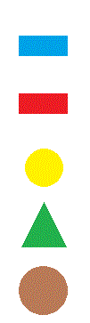

<html lang="pl">
<head>
    <meta charset="utf-8">
    <title>Kompletny Layout Strony z Mapą</title>
    
</head>
<body>
    <table>
        <tr>
            <td colspan="3" class="logo-container">
                
            </td>
        </tr>
        <tr>
            <td width="18%" align="center">
                <b>Lewe menu</b>
                <ul>
                    <li><a href="https://zse.edu.gdansk.pl/" target="obszar_glowny">Strona ZSE</a></li>
                    <li><a href="https://www.kuratorium.gda.pl/" target="obszar_glowny">Kuratorium</a></li>
                    <li><a href="https://pl.wikipedia.org/wiki/Plik:ZSE_Gdańsk.jpg" target="obszar_glowny">Wikipedia</a></li>
                    <li><a href="https://www.wikipedia.org" target="obszar_glowny">Wikipedia</a></li>
                </ul>
            </td>
            <td align="center">
                <iframe name="obszar_glowny" src="about:blank"></iframe>
            </td>
            <td width="18%" align="center">
                <b>Prawe menu</b>
                
                <map name="mapa_kowalski">
                    <area shape="poly" coords="5,5,95,5,50,95" href="plik1.zip" alt="Opcja 1">
                    <area shape="rect" coords="0,100,100,150" href="https://kejpy.github.io/tabela/" target="obszar_glowny" alt="Opcja 2">
                    <area shape="circle" coords="50,200,25" href="https://kejpy.github.io/formularz/" target="obszar_glowny" alt="Opcja 3">
                    <area shape="poly" coords="5,230,95,230,50,290" href="mailto:kacper.wawrzyniakpekar@gmail.com" alt="Opcja 4">
                    <area shape="rect" coords="0,300,100,350" href="https://kacperwawrzyniak-pekar.github.io/index/" target="obszar_glowny" alt="Opcja 5">
                </map>
            </td>
        </tr> 
        <tr>
            <td colspan="3" align="center">
                

    

            </td>
        </tr>
    </table>
</body>
</html>
